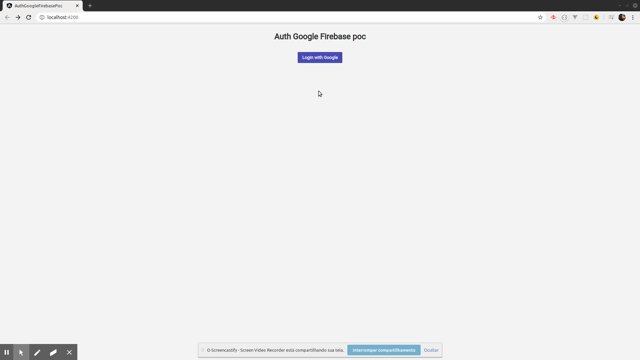

<h2 align="center">Auth Google Firebase Poc :guardsman:</h2>

Using [Firebase](https://firebase.google.com/?hl=pt-br) with google auth option, using [lazy loading](https://angular.io/guide/lazy-loading-ngmodules) and [guards](https://angular.io/api/router/CanActivate) for get more security with login requests; 

## What you need
Need access [Firebase](https://firebase.google.com/?hl=pt-br) console, get your credentials in `add app` then in `Project overview` go in settings and get the sample in `Firebase SDK snippet`;

## Google authentication
Go in `Develop` tab then `Sign-in method` and enable `Google`;

## Install dependencies
- `npm install`;

## Run application
- `npm start`;

<h2 align="center">Demo</h2>

  

